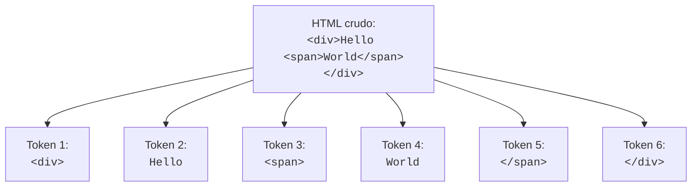

# ¿Qué es la tokenización?

Cuando un navegador recibe un archivo HTML, no puede entenderlo de inmediato como texto plano.  
Primero, necesita **dividir** la cadena completa en **piezas significativas**.  
Este proceso se llama **tokenización**.

---

## ¿Qué es un token?

Un **token** es una unidad pequeña de información reconocible:  
puede ser una etiqueta como `<div>`, un texto como `Hello`, o una etiqueta de cierre como `</span>`.

Tokenizar significa **identificar y separar** estos bloques del texto original.

---

## ¿Por qué es importante?

- Permite **interpretar** el contenido paso a paso.
- Facilita **clasificar**, **construir** estructuras y **modificar** el contenido después.
- Es el **primer paso** antes de analizar (parsear) o transformar el HTML.

En este módulo, vamos a realizar **una tokenización básica**:  
simplemente separar cada etiqueta y cada texto en un arreglo.

---

## Resumen visual

De esta entrada:

```html
<div>Hello <span>World</span></div>
```

Queremos obtener este arreglo de tokens:

```JS
["<div>", "Hello ", "<span>", "World", "</span>", "</div>"]
```

Tokenizar no interpreta, solo separa.
Interpretar el significado de cada token vendrá en el siguiente módulo.

