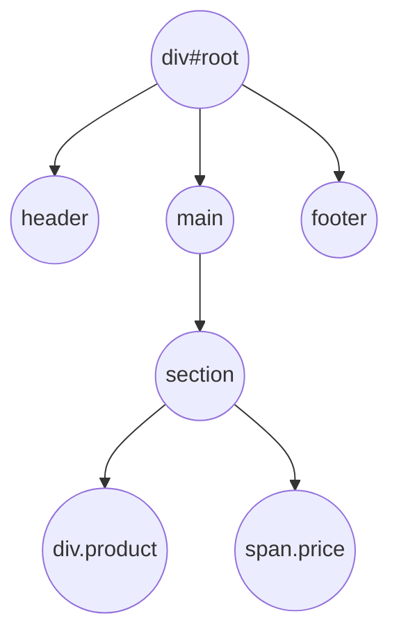

# Introducción: Árboles de Nodos y el DOM

Cuando el navegador recibe un archivo HTML, **no trabaja directamente con el texto**.  
El motor de JavaScript (y otros motores del navegador) **lee** ese HTML y **construye una estructura de nodos en memoria**.  
Esta estructura se llama **DOM**: **Document Object Model**.

---

## ¿Qué es el DOM?

- El DOM es un **árbol** de nodos.
- Cada etiqueta HTML crea un **nodo de elemento** (`
`, `
`, ``, etc).
- Cada bloque de texto entre etiquetas crea un **nodo de texto** ("Hola", "mundo", etc).
- Cada nodo puede tener **hijos** (otros nodos dentro de él).

El navegador **nunca manipula el HTML original**.  
Siempre trabaja **sobre el árbol** que creó a partir del HTML.

---

## ¿Cómo se construye un árbol de nodos?

El navegador sigue un proceso sencillo:

1. **Lee** el HTML de izquierda a derecha.
2. **Cuando encuentra una etiqueta de apertura** (`
`, `
`, `li`, o muchos otros):
   - Crea un **nuevo nodo de elemento**.
   - Lo **agrega como hijo** al nodo actual.
   - El nuevo nodo se convierte en el **nodo actual** (baja un nivel).
3. **Cuando encuentra un texto**:
   - Crea un **nodo de texto**.
   - Lo agrega como hijo del nodo actual.
4. **Cuando encuentra una etiqueta de cierre** (`
`, `
`, `</li>`):
   - **Sube un nivel** (el padre vuelve a ser el nodo actual).

Este comportamiento puede modelarse usando una **estructura tipo stack** (pila).

---

## Relación con tu ejercicio

En este módulo vas a construir **tu propio árbol de nodos**:

- A partir de un arreglo de **tokens** (no directamente desde HTML).
- Simulando cómo **un navegador arma el DOM**.
- Usando un **stack** para seguir la jerarquía de apertura y cierre de nodos.

El objetivo es **entender cómo se representan documentos en memoria**, no solo cómo se ven en texto.

---

---

## 🧪 Extra opcional: Cómo implementar `querySelector` en tu árbol de nodos

Hasta ahora, construiste un árbol DOM simple.  
Pero en el navegador, los nodos tienen métodos útiles para buscar elementos descendientes, como:

document.querySelector('.boton')  
document.querySelector('#principal')

Vamos a simular ese comportamiento en nuestros propios nodos.

---

### 🧠 ¿Qué es `querySelector`?

Es un método que busca el primer nodo descendiente que coincida con un selector CSS simple:

- `.clase` → busca un nodo con esa clase
- `#id` → busca un nodo con ese id
- `div` → busca un nodo con ese nombre de etiqueta

En esta etapa solo usaremos selectores simples: clases (`.x`), ids (`#x`), o nombres (`span`, `p`, etc).

---

### 🔁 ¿Cómo lo implemento?

Tu árbol de nodos ya está anidado, pero para poder buscar necesitas recorrerlo completamente.

Este tipo de recorrido se llama recursivo, y es una técnica común en estructuras de árbol.

---
### 💡 ¿Qué es recursividad?

La recursividad es una técnica donde una función se llama a sí misma para resolver un problema en partes más pequeñas.

En estructuras como árboles (como nuestro DOM), es una herramienta ideal para recorrer cada rama sin saber de antemano cuántos niveles tiene.

---

🔁 Para recorrer un árbol y aplicar un `querySelector`, podrías usar esta lógica:

1. Revisar el nodo actual: ¿coincide con el selector?
2. Si sí, devolver el nodo actual.
3. Si no, revisar todos sus hijos **llamando la misma función para cada uno**.
4. Si algún hijo devuelve un resultado válido, devolverlo.
5. Si ningún hijo tiene coincidencias, devolver null.

---

🤔 ¿Por qué usar recursividad?

Porque no sabes cuántos niveles puede tener tu árbol.  
Podrías tener un `
` dentro de un `<section>` dentro de otro `
` dentro de un `<main>` y así sucesivamente.

Un bucle `for` por sí solo no bastaría para cubrir todos los niveles.  
Pero con recursividad, cada función se encarga de explorar un nivel y todos los niveles que contiene.

---

📊 A continuación, un ejemplo visual de un árbol DOM con 3 niveles de profundidad.
Este tipo de estructura es la que vas a recorrer con tu `querySelector`

---

### 📚 Sugerencia para aprender más

Si no conoces recursividad, busca estos términos:

- "recorrer árbol con recursividad"
- "recursive tree traversal"
- En español: recorrer estructura de árbol con funciones recursivas

No te preocupes por performance.  
Este ejercicio es solo para familiarizarte con cómo funcionan las búsquedas en un DOM real.

---

### ✅ Ejemplo de uso esperado

Imagina que tienes este HTML:

  ¡Hola!

Después de convertirlo en un árbol:

const arbol = construirArbol(tokens)  
const nodo = arbol.querySelector('.destacado')

`nodo` debería ser el nodo `span` con clase "destacado".

---

⚠️ Este ejercicio es completamente opcional.  
No será usado en los siguientes módulos, pero es excelente para practicar cómo funciona el navegador internamente.
