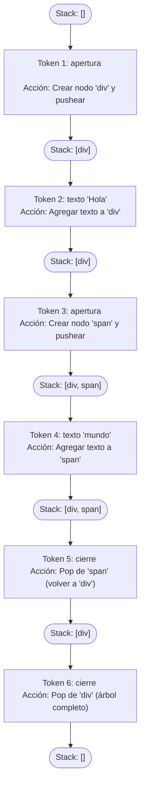

# Introducción: Árboles de Nodos y el DOM

Cuando el navegador recibe un archivo HTML, **no trabaja directamente con el texto**.  
El motor de JavaScript (y otros motores del navegador) **lee** ese HTML y **construye una estructura de nodos en memoria**.  
Esta estructura se llama **DOM**: **Document Object Model**.

---

## ¿Qué es el DOM?

- El DOM es un **árbol** de nodos.
- Cada etiqueta HTML crea un **nodo de elemento** (`
`, `
`, ``, etc).
- Cada bloque de texto entre etiquetas crea un **nodo de texto** ("Hola", "mundo", etc).
- Cada nodo puede tener **hijos** (otros nodos dentro de él).

El navegador **nunca manipula el HTML original**.  
Siempre trabaja **sobre el árbol** que creó a partir del HTML.

---

## ¿Cómo se construye un árbol de nodos?

El navegador sigue un proceso sencillo:

1. **Lee** el HTML de izquierda a derecha.
2. **Cuando encuentra una etiqueta de apertura** (`
`, `
`, `li`, o muchos otros):
   - Crea un **nuevo nodo de elemento**.
   - Lo **agrega como hijo** al nodo actual.
   - El nuevo nodo se convierte en el **nodo actual** (baja un nivel).
3. **Cuando encuentra un texto**:
   - Crea un **nodo de texto**.
   - Lo agrega como hijo del nodo actual.
4. **Cuando encuentra una etiqueta de cierre** (`
`, `
`, `</li>`):
   - **Sube un nivel** (el padre vuelve a ser el nodo actual).

Este comportamiento puede modelarse usando una **estructura tipo stack** (pila).

---

## Relación con tu ejercicio

En este módulo vas a construir **tu propio árbol de nodos**:

- A partir de un arreglo de **tokens** (no directamente desde HTML).
- Simulando cómo **un navegador arma el DOM**.
- Usando un **stack** para seguir la jerarquía de apertura y cierre de nodos.

El objetivo es **entender cómo se representan documentos en memoria**, no solo cómo se ven en texto.

---

